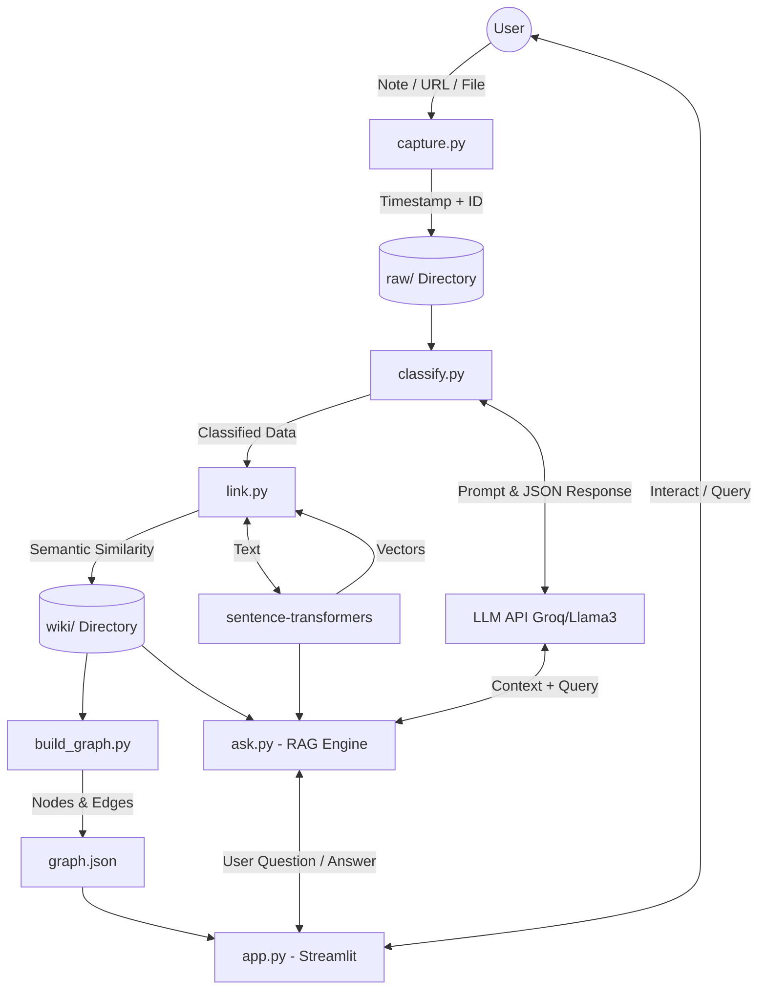

# Second Self: System Architecture

## 1. System Overview
**Second Self** is an end-to-end local-first personal knowledge management system. It acts as an AI-powered "second brain" that ingests raw information (notes, links, files), automatically organizes it using the PARA framework, discovers implicit relationships using vector embeddings, visualizes the knowledge graph, and provides a conversational interface to query the accumulated knowledge via Retrieval-Augmented Generation (RAG).

---

## 2. Core Components

The architecture is broken down into 5 distinct pipeline stages and components, correlating with the weekly milestones.

### 2.1. Ingestion Pipeline (The Archivist)
* **Component:** `capture.py`
* **Purpose:** Acts as the single entry point for all new information into the system.
* **Mechanism:** 
  * Accepts plain text, URLs, or file paths.
  * Generates a unique identifier (UUID or timestamp-based ID) and a timestamp.
  * Saves the raw content as a Markdown or text file in the local `raw/` directory.

### 2.2. Classification Engine (The Sorting Hat)
* **Component:** `classify.py`
* **Purpose:** Replaces manual tagging and folder organization by using a Large Language Model (LLM).
* **Mechanism:**
  * Reads newly ingested files from `raw/`.
  * Prompts a fast/free LLM API (e.g., Groq using Llama 3) to analyze the text.
  * The LLM returns a structured JSON containing:
    1. **PARA Category:** Projects, Areas, Resources, or Archives.
    2. **Tags:** A small list of relevant semantic tags.
    3. **Summary:** A concise one-line summary of the content.
  * The file is then structurally updated (e.g., adding YAML frontmatter) and staged for the wiki.

### 2.3. Auto-Linking Engine (Connect the Dots)
* **Component:** `link.py`
* **Purpose:** Discovers implicit relationships between notes without requiring manual `[[wikilinks]]`.
* **Mechanism:**
  * Uses a local embedding model (e.g., `sentence-transformers` such as `all-MiniLM-L6-v2`) to convert note contents into dense vector representations.
  * Compares the embedding of a new note against the embeddings of all existing notes in the `wiki/` directory.
  * Calculates semantic similarity (e.g., cosine similarity).
  * If similarity exceeds a predefined threshold, the system automatically injects cross-references (links) into the notes.
  * The fully processed notes are finalized and saved into the `wiki/` directory.

### 2.4. Graph Generator (The Cartographer)
* **Component:** `build_graph.py`
* **Purpose:** Converts the file-based knowledge base into a structured graph dataset for visualization.
* **Mechanism:**
  * Parses the `wiki/` directory.
  * Represents each note as a **Node** (containing ID, title/summary, and PARA category).
  * Represents each auto-generated or explicit link as an **Edge** connecting two Nodes.
  * Exports this topology to a static `graph.json` file.

### 2.5. Search & Q&A Engine (The Oracle)
* **Component:** `ask.py`
* **Purpose:** Implements Retrieval-Augmented Generation (RAG) to answer questions based on personal notes.
* **Mechanism:**
  1. **Embed Query:** Converts the user's natural language question into a vector using the same `sentence-transformers` model.
  2. **Retrieve:** Performs a vector similarity search to find the top-K most relevant notes from the `wiki/`.
  3. **Synthesize:** Constructs a prompt containing the user's question and the content of the retrieved notes as context. Sends this to the LLM (Groq / Llama 3) to generate a grounded, synthesized answer.

### 2.6. User Interface & Deployment
* **Component:** `app.py`
* **Purpose:** Provides a unified web interface for interacting with the brain.
* **Mechanism:**
  * Built using **Streamlit**.
  * Loads `graph.json` and renders an interactive, force-directed graph using a JavaScript library (`vis-network` or `Cytoscape.js`) embedded in Streamlit (e.g., via `streamlit-agraph`).
  * Provides a chat/search interface that hooks into `ask.py` to stream answers back to the user.
  * Designed to be deployed on **Streamlit Cloud** or **Hugging Face Spaces** for public URL access.

---

## 3. Data Flow



---

## 4. Technology Stack

| Category | Technology | Justification |
| :--- | :--- | :--- |
| **Language** | Python 3 | Best ecosystem for data processing, AI, and scripting. |
| **LLM Provider** | Groq (Llama 3 8B/70B) | Extremely fast inference, free tier, excellent at JSON extraction and RAG synthesis. |
| **Embeddings** | `sentence-transformers` | Runs locally, free, preserves privacy, fast (e.g., `all-MiniLM-L6-v2`). |
| **Data Storage** | Local File System (Markdown) | Future-proof, easily parsed, zero database overhead. |
| **Graph Visualization**| `vis-network` / `Cytoscape.js` | Industry standard for interactive network graphs; handles physics and drag/drop elegantly. |
| **Frontend UI** | Streamlit | Rapid prototyping for data apps in Python; built-in chat UI components. |
| **Deployment** | Streamlit Cloud / HF Spaces | Free hosting, easy CI/CD from GitHub, provides public URLs. |

---

## 5. Directory Structure Mapping

```text
secondself/
├── raw/               # Staging area for raw captured text
├── wiki/              # Final storage for processed, classified, and linked Markdown files
├── capture.py         # [CLI/Script] Entry point for data ingestion
├── classify.py        # [Script] LLM-based PARA categorization 
├── link.py            # [Script] Local embedding generation and similarity linking
├── build_graph.py     # [Script] Translates wiki/ to graph topology
├── graph.json         # [Data] Exported graph structure (Nodes & Edges)
├── ask.py             # [Module] RAG search functions
├── app.py             # [Web App] Streamlit interface (Graph + Q&A)
├── requirements.txt   # Python dependencies
└── README.md          # Project documentation
```
